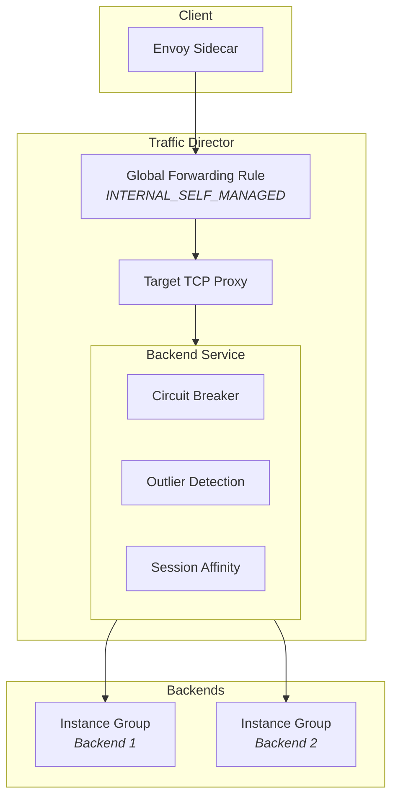

[][homepage]

[][releases]
[][license]
[](https://www.terraform.io/)
[](https://registry.terraform.io/providers/hashicorp/google/latest)

# Terraform Google Traffic Director

Terraform module for creating Google Cloud Traffic Director backend services
with TCP proxy load balancing. This module is designed for service mesh
architectures using Envoy sidecars with Managed Instance Groups (MIGs).

## Table of Contents

- [Features](#features)
- [Architecture](#architecture)
- [Usage](#usage)
- [Requirements](#requirements)
- [Inputs](#inputs)
- [Outputs](#outputs)
- [Examples](#examples)
- [Testing](#testing)
- [About Boozt](#about-boozt)
- [Reporting Issues](#reporting-issues)
- [Contributing](#contributing)
- [License](#license)

## Features

- **Traffic Director Integration** - Creates `INTERNAL_SELF_MANAGED` backend
  services for use with Envoy proxies
- **Flexible Load Balancing** - Supports ROUND_ROBIN, RING_HASH (sticky
  sessions), LEAST_REQUEST, and more
- **Circuit Breakers** - Configurable connection limits to prevent cascade
  failures
- **Outlier Detection** - Automatic ejection of unhealthy backends
- **Health Check Integration** - Uses external health checks for backend
  monitoring

## Architecture



## Usage

### Basic Example (Round-Robin)

```hcl
module "redis_read" {
  source  = "boozt-platform/traffic-director/google"
  version = "~> 1.0"

  project_id = "my-project"
  network    = "default"
  name       = "redis-read"

  port_name  = "redis"
  port_range = "6379"

  health_check_id = google_compute_health_check.redis.id
  instance_groups = [
    google_compute_region_instance_group_manager.redis.instance_group
  ]

  locality_lb_policy = "ROUND_ROBIN"
  timeout_sec        = 2
}
```

### Sticky Sessions (Write Operations)

```hcl
module "redis_write" {
  source  = "boozt-platform/traffic-director/google"
  version = "~> 1.0"

  project_id = "my-project"
  network    = "default"
  name       = "redis-write"

  port_name  = "redis"
  port_range = "16379"

  health_check_id = google_compute_health_check.redis.id
  instance_groups = [
    google_compute_region_instance_group_manager.redis.instance_group
  ]

  # Sticky session configuration
  session_affinity   = "CLIENT_IP"
  locality_lb_policy = "RING_HASH"

  timeout_sec                     = 5
  connection_draining_timeout_sec = 10
  max_connections_per_instance    = 1000

  circuit_breakers = {
    max_connections = 1024
  }

  outlier_detection = {
    consecutive_errors = 5
    interval = {
      seconds = 10
    }
    base_ejection_time = {
      seconds = 30
    }
  }
}
```

<!-- BEGIN_TF_DOCS -->
## Requirements

| Name | Version |
|------|---------|
| <a name="requirement_terraform"></a> [terraform](#requirement\_terraform) | >= 1.3.0 |
| <a name="requirement_google"></a> [google](#requirement\_google) | >= 4.50.0, < 7.0.0 |

## Providers

| Name | Version |
|------|---------|
| <a name="provider_google"></a> [google](#provider\_google) | 6.50.0 |

## Inputs

| Name | Description | Type | Default | Required |
|------|-------------|------|---------|:--------:|
| <a name="input_health_check_id"></a> [health\_check\_id](#input\_health\_check\_id) | The ID (self\_link) of an externally created health check resource. | `string` | n/a | yes |
| <a name="input_instance_groups"></a> [instance\_groups](#input\_instance\_groups) | A list of instance group URLs (self\_links) to be used as backends. | `list(string)` | n/a | yes |
| <a name="input_name"></a> [name](#input\_name) | The base name for resources. Suffixes will be added (e.g., '-bs' for backend service, '-proxy' for TCP proxy). | `string` | n/a | yes |
| <a name="input_network"></a> [network](#input\_network) | The VPC network name or self\_link to which resources will be attached. | `string` | n/a | yes |
| <a name="input_port_name"></a> [port\_name](#input\_port\_name) | The named port on the instance group (must match a named\_port defined on the MIG). | `string` | n/a | yes |
| <a name="input_port_range"></a> [port\_range](#input\_port\_range) | The port range for the forwarding rule (e.g., '6379' or '8080-8090'). | `string` | n/a | yes |
| <a name="input_project_id"></a> [project\_id](#input\_project\_id) | The ID of the GCP project in which to provision resources. | `string` | n/a | yes |
| <a name="input_balancing_mode"></a> [balancing\_mode](#input\_balancing\_mode) | The balancing mode for backends. Use 'CONNECTION' for TCP traffic. | `string` | `"CONNECTION"` | no |
| <a name="input_circuit_breakers"></a> [circuit\_breakers](#input\_circuit\_breakers) | Circuit breaker configuration for the backend service. | <pre>object({<br/>    max_connections      = optional(number)<br/>    max_pending_requests = optional(number)<br/>    max_requests         = optional(number)<br/>    max_retries          = optional(number)<br/>  })</pre> | `null` | no |
| <a name="input_connection_draining_timeout_sec"></a> [connection\_draining\_timeout\_sec](#input\_connection\_draining\_timeout\_sec) | Time in seconds to wait for connections to drain when removing a backend. | `number` | `0` | no |
| <a name="input_labels"></a> [labels](#input\_labels) | Labels to apply to the forwarding rule resource. | `map(string)` | `{}` | no |
| <a name="input_locality_lb_policy"></a> [locality\_lb\_policy](#input\_locality\_lb\_policy) | The load balancing policy. Use 'ROUND\_ROBIN' for even distribution or 'RING\_HASH' for consistent hashing (sticky sessions). | `string` | `"ROUND_ROBIN"` | no |
| <a name="input_log_config_enable"></a> [log\_config\_enable](#input\_log\_config\_enable) | Whether to enable logging for the backend service. | `bool` | `false` | no |
| <a name="input_log_config_sample_rate"></a> [log\_config\_sample\_rate](#input\_log\_config\_sample\_rate) | The sampling rate for logging (0.0 to 1.0). Only applies when log\_config\_enable is true. | `number` | `1` | no |
| <a name="input_max_connections"></a> [max\_connections](#input\_max\_connections) | Maximum number of simultaneous connections for the entire backend service. | `number` | `null` | no |
| <a name="input_max_connections_per_instance"></a> [max\_connections\_per\_instance](#input\_max\_connections\_per\_instance) | Maximum number of simultaneous connections per backend instance. | `number` | `null` | no |
| <a name="input_outlier_detection"></a> [outlier\_detection](#input\_outlier\_detection) | Outlier detection configuration for automatic ejection of unhealthy backends. | <pre>object({<br/>    consecutive_errors   = optional(number)<br/>    max_ejection_percent = optional(number)<br/>    interval = optional(object({<br/>      seconds = number<br/>      nanos   = optional(number)<br/>    }))<br/>    base_ejection_time = optional(object({<br/>      seconds = number<br/>      nanos   = optional(number)<br/>    }))<br/>  })</pre> | `null` | no |
| <a name="input_session_affinity"></a> [session\_affinity](#input\_session\_affinity) | The session affinity for the backend service. Use 'CLIENT\_IP' with 'RING\_HASH' for sticky sessions. | `string` | `"NONE"` | no |
| <a name="input_timeout_sec"></a> [timeout\_sec](#input\_timeout\_sec) | Backend service timeout in seconds. How long to wait for a backend to respond. | `number` | `30` | no |

## Outputs

| Name | Description |
|------|-------------|
| <a name="output_backend_service"></a> [backend\_service](#output\_backend\_service) | The created backend service resource attributes. |
| <a name="output_forwarding_rule"></a> [forwarding\_rule](#output\_forwarding\_rule) | The created forwarding rule resource attributes. |
| <a name="output_tcp_proxy"></a> [tcp\_proxy](#output\_tcp\_proxy) | The created TCP proxy resource attributes. |
<!-- END_TF_DOCS -->

## Examples

- [Complete Example](./examples/complete) - Full setup with MIG, health checks,
  and read/write services

## Testing

This module includes Terraform native tests:

```bash
# Run all tests
task test

# Run with verbose output
task test:verbose

# Run specific test file
task test:filter -- validation
```

## Development

This project uses [Task](https://taskfile.dev/) for automation. Available tasks:

```bash
task --list          # Show all available tasks
task fmt             # Format Terraform files
task validate        # Validate configuration
task lint            # Run tflint
task sec             # Run tfsec security scan
task docs            # Generate documentation
task ci              # Run all CI checks
task clean           # Clean up generated files
```

### Local Development Setup

1. Install [mise](https://mise.jdx.dev/) for tool version management
2. Run `mise install` to install required tools
3. Run `task hooks:install` to set up git hooks

## About Boozt

Boozt is a leading and fast-growing Nordic technology company selling fashion
and lifestyle online mainly through its multi-brand webstore [Boozt.com][boozt]
and [Booztlet.com][booztlet].

The company is focused on using cutting-edge, in-house developed technology to
curate the best possible customer experience.

With offices in Sweden, Denmark, Lithuania and Poland, we pride ourselves in
having a diverse team, consisting of 1100+ employees and 38 nationalities.

See our [Medium][blog] blog page for technology-focused articles. Would you
like to make your mark by working with us at Boozt? Take a look at our
[latest hiring opportunities][careers].

## Reporting Issues

Please provide a clear and concise description of the problem or the feature
you're missing along with any relevant context or screenshots.

Check existing issues before reporting to avoid duplicates.

Please follow the [Issue Reporting Guidelines][issues] before opening a new
issue.

## Contributing

Contributions are highly valued and very welcome! For the process of reviewing
changes, we use [Pull Requests][pull-request]. For a detailed information
please follow the [Contribution Guidelines][contributing]

## License

[][license]

This project is licensed under the MIT. Please see [LICENSE][license] for
full details.

[homepage]: https://github.com/boozt-platform/terraform-google-traffic-director
[releases]: https://github.com/boozt-platform/terraform-google-traffic-director/releases
[issues]: https://github.com/boozt-platform/terraform-google-traffic-director/issues
[pull-request]: https://github.com/boozt-platform/terraform-google-traffic-director/pulls
[contributing]: ./docs/CONTRIBUTING.md
[license]: ./LICENSE
[boozt]: https://www.boozt.com/
[booztlet]: https://www.booztlet.com/
[blog]: https://medium.com/boozt-tech
[careers]: https://careers.booztgroup.com/
